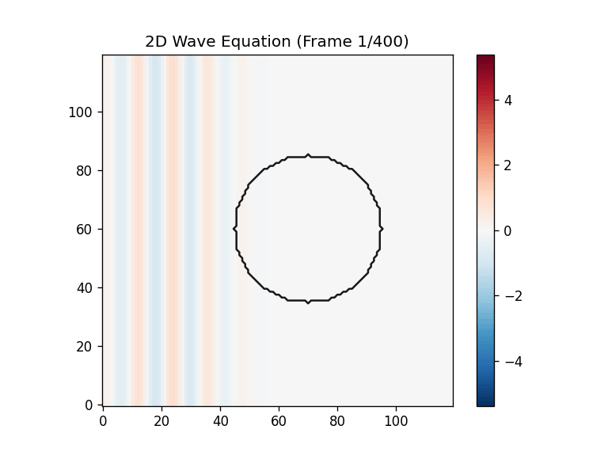

# 2D Wave Equation Simulation (Finite Differences)

Small Python project that simulates the 2D wave equation on a grid using an explicit finite-difference scheme and animates the result with Matplotlib. The simulation supports a spatially varying wave speed `c(x, y)` (example: a circular "lens" region with a different `c`).
The animation can also overlay the lens outline so it's easy to see where `c(x, y)` changes.



## Hero Demo (Refraction + Sponge + Export)

```powershell
python .\examples\run_simulation.py --init-mode plane_wave --plane-xc -40 --plane-lam 12 --sigma 15 --c-outside 8 --c-inside 5 --lens-x0 10 --lens-y0 0 --lens-r 25 --steps 2000 --record-every 5 --sponge-width 15 --sponge-gamma-max 2.0 --sponge-power 10 --save out.gif --no-show
```

## Quickstart

1. Create a virtual environment and install dependencies:

```powershell
python -m venv .venv
.\.venv\Scripts\Activate.ps1
pip install -r requirements.txt
```

2. Run the demo:

```powershell
python .\examples\run_simulation.py
```

## Controls

The example script exposes a few useful flags:

```powershell
python .\examples\run_simulation.py --init-mode ring --steps 4000 --interval-ms 25
python .\examples\run_simulation.py --init-mode impulse_velocity --amplitude 2.0
python .\examples\run_simulation.py --init-mode ring --steps 5000 --record-every 5 --c-outside 8 --c-inside 5 --lens-x0 10 --lens-y0 0 --lens-r 25
python .\examples\run_simulation.py --init-mode plane_wave --plane-xc -40 --plane-lam 12 --sigma 15 --c-outside 8 --c-inside 5 --lens-x0 10 --lens-y0 0 --lens-r 25 --steps 4000 --record-every 5
python .\examples\run_simulation.py --init-mode plane_wave --plane-xc -40 --plane-lam 12 --sigma 15 --c-outside 8 --c-inside 5 --lens-x0 10 --lens-y0 0 --lens-r 25 --steps 4000 --record-every 5 --sponge-width 15 --sponge-gamma-max 2.0 --sponge-power 2
python .\examples\run_simulation.py --init-mode plane_wave --plane-xc -40 --plane-lam 12 --sigma 15 --c-outside 8 --c-inside 5 --lens-x0 10 --lens-y0 0 --lens-r 25 --steps 4000 --record-every 5 --sponge-width 15 --sponge-gamma-max 2.0 --sponge-power 2 --save out.gif --no-show
python .\examples\run_simulation.py --c-outside 8 --c-inside 5 --lens-r 30 --init-mode ring --steps 6000
python .\examples\run_simulation.py --c-outside 8 --c-inside 6 --lens-x0 10 --lens-y0 0 --lens-r 25
python .\examples\run_simulation.py --bc periodic --init-mode ring --steps 4000
```

Initial conditions available via `--init-mode`:
- `gaussian`: smooth bump (good default)
- `ring`: expanding circular front
- `impulse_velocity`: starts from rest (`u0 = 0`) with an initial velocity impulse in the center
- `plane_wave`: a localized plane-wave packet traveling primarily in `+x` (use `--plane-xc` / `--plane-lam`)

Plane-wave parameters (used with `--init-mode plane_wave`):
- `--plane-xc`: plane-wave packet center along `x` (grid coordinates, centered at 0)
- `--plane-lam`: wavelength in grid cells

Absorbing boundary (sponge layer):
- `--sponge-width`: thickness of the damping layer in grid cells (0 disables the sponge)
- `--sponge-gamma-max`: maximum damping strength at the boundary (0 disables the sponge)
- `--sponge-power`: ramp exponent controlling how smoothly damping increases toward the boundary

Lens parameters:
- `--c-outside`: wave speed outside the lens region
- `--c-inside`: wave speed inside the lens region
- `--lens-x0`, `--lens-y0`: lens center (in grid coordinates, centered at 0)
- `--lens-r`: lens radius (same units as the grid coordinates)

Lens overlay:
- The example runner draws the lens boundary as a black contour on top of the wave field.

Boundary conditions (`--bc`):
- `neumann` (default): reflective boundary (`du/dn = 0`)
- `dirichlet`: fixed boundary (`u = 0`)
- `periodic`: wrap around (toroidal domain)

Export / Saving:
- Use `--save out.gif` to render and save a GIF (requires `pillow`, included in `requirements.txt`).
- Use `--save out.mp4` to render and save an MP4 (requires `ffmpeg` available on your system).
- Add `--no-show` when saving from CI or when you don't want a window to pop up.

## Notes (Numerics)

- The solver uses a standard explicit update:
  - `u_new = 2*u - u_prev + dt^2 * div(c^2 * grad(u))`
- If you don't pass `--dt`, the simulation picks a stable `dt` automatically using a CFL condition based on `max(c(x, y))`.

### Why Amplitude Can Grow Over Time

This simulation is (by default) non-dissipative, so waves can bounce and interfere:
- With `--bc neumann` (reflective), energy stays in the domain and repeated reflections can create higher local peaks through constructive interference.
- With a lens (`c_inside != c_outside`), refraction can focus waves and increase local peak amplitude even if the total energy is not increasing.
- If you set `--dt` too large (violating CFL), the scheme can become unstable and amplitudes may blow up.
